<p akugb=:keft>  
	  
	  
</p>  

<!--
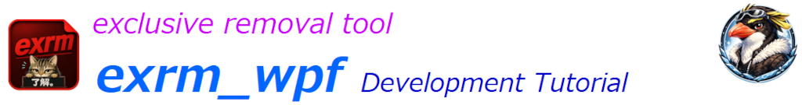  
-->

# OverView  
目的 : VisualStudioを使用したアプリケーション開発  
内容 : 排他的ファイル/ディレクトリ削除ツール [exrm_wpf]  

|Item|Content|
|:--|:--|
|OS||  
|IDE||  
|Language|　**/**　　**/**　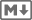  
|Framework| |
|SHELL|
> [!caution]
> Trademarks: Company names, product names, and logos used in documents related to this project are trademarks or registered trademarks of their respective owners. They are cited solely for the purpose of describing the technologies used.
 

> [!NOTE]  
> ※ 凡例  
> 　 デスクトップ、️：マウスクリック、 ：ボタン、：Press the Key、：Enter key press、  
> 　：テキスト、**a** / **b**：選択(**a** or **b**)、：ウィンドウ/メニュー/フォーム、⇒：次動作、：コメント、  
> ：ウィンドウ / ペイン / ダイアログ 、：ターミナル、  : 編集 / コーディング / 描画  
> ：クリックでText表示 (表示されたTextの右上にある   でコピー)  
> 縮小表示されている画像は  で拡大されます (マウスカーソルが  になる画像が縮小表示画像です)。  
>
>  ブラウザを **Darkモード** にして頂けると、見やすくなります。  

# ファイル/フォルダーの排他的削除ツール [exrm]作成手順

※｢.NET 10.0SDK｣をインストール (手順省略)  
　　[ Installer ](https://dotnet.microsoft.com/ja-jp/download/dotnet/10.0)  
※｢VisualStudioInstaller｣で、ワークロード｢.NETデスクトップ開発｣をインストール (手順省略)  
　　[ Source code / GitHub](https://github.com/AHazeyama/public/tree/main/exrm_wpf)

## VisualStudio起動
　 タスクバーの

 

 
　
｣   
　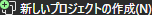
   
　　  新しいプロジェクトの作成   
　　　
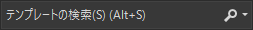
  で WPF を検索  
　　　　
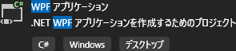


 
  
　　  新しいプロジェクトを構成します   
　　　 
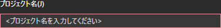
 に 
exrm_wpf を入力 
  
　　　 

 に 
保存先 を入力、または  
　　　 …

 　保存先を選択  
　　　


ソリューションとプロジェクトを同じディレクトリに配置する


 
  
　  追加情報   
　　　
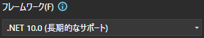
 は 
 `.NET 10.0(長期的なサポート)`  を選択


  
　　　　　　　  
　　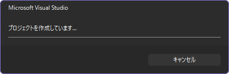  
　　　　　　　  
　　[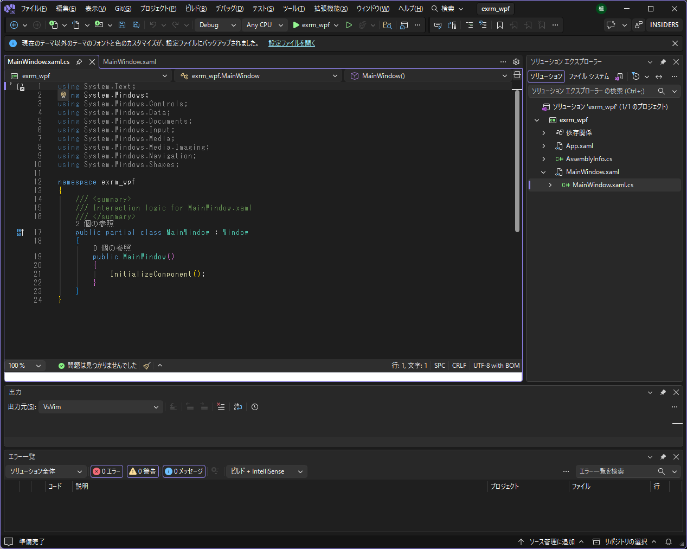](./assets/prtsc/M_VS_PANE_all.png)  

## UIモジュール作成  
  ソリューションエクスプローラー   
　  Mainwindow.xaml  W   
　　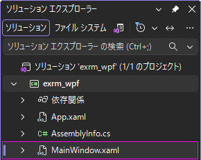  
　　　　　　　　　　  
　　[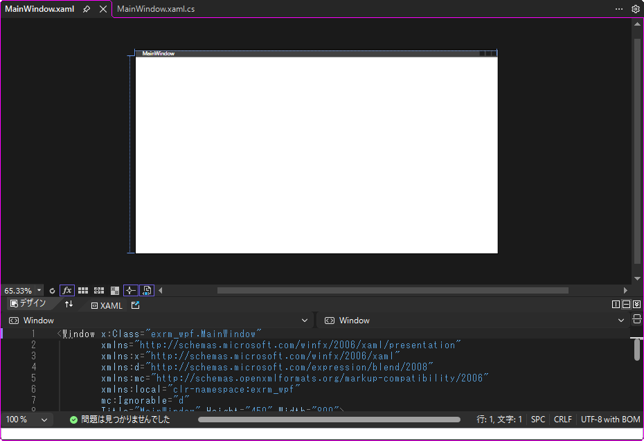](./assets/prtsc/M_VS_PANE_mainwindow-xaml.png)
　
　[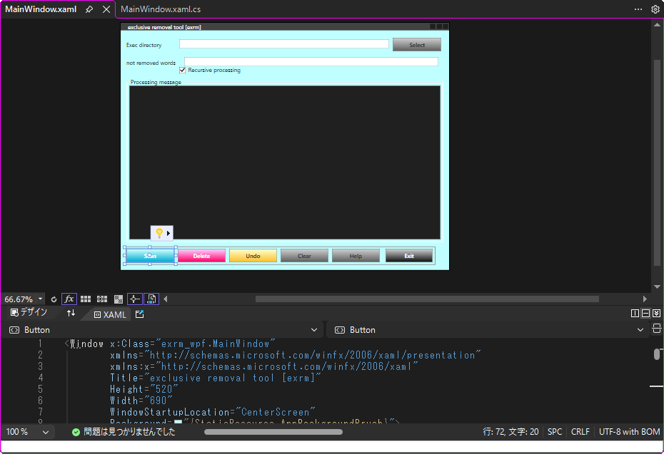](./assets/prtsc/M_VS_PANE_mainwindow-xaml-after.png)  
　　編集 ( Link先はGUI実装済み)  
　　　[ MainWindow.xaml](https://github.com/AHazeyama/exrm_wpf/blob/main/MainWindow.xaml)  

## イベント処理モジュール作成  
  ソリューションエクスプローラー   
　　  C# Mainwindow.xaml.cs  
   
　　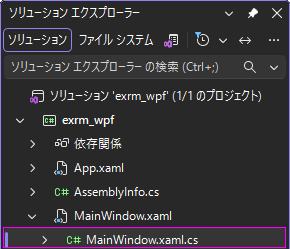  
　　　　　　　　　  
　　[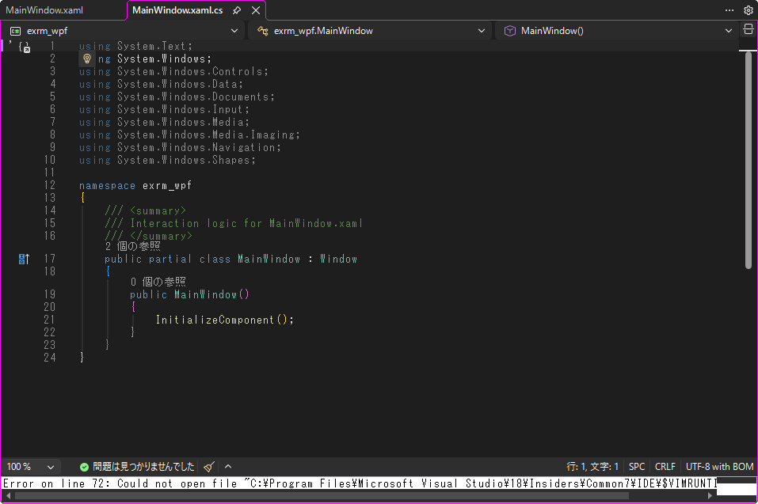](./assets/prtsc/M_VS_PANE_mainwindow-xaml-cs.png)　
　
[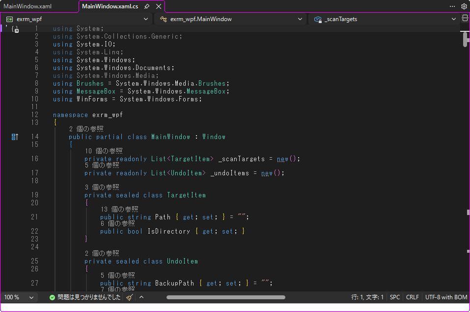](./assets/prtsc/M_VS_PANE_mainwindow-xaml-cs-after.png)  
　　  : **削除** ＋ **バックアップ** ＋ **Undo** の各ロジックモジュール付加  
　　　[  MainWindow.xaml.cs](https://github.com/AHazeyama/exrm_wpf/blob/main/MainWindow.xaml.cs)　　　　　　  Link先は  済み  

## ロジックモジュール作成  
　  ソリューションエクスプローラー    
　　 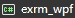  右   
　   
　 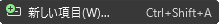    
　　[](./assets/prtsc/M_VS_PANE_solution-explorer03%20.png)  
　　　　　　　  
　　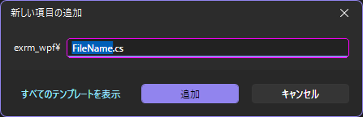  ExrmCore.cs  指定 
   
　　　　　　　  
　　[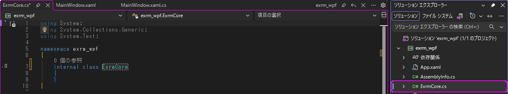](./assets/prtsc/M_VS_PANE_add-exrmcore-cs.png)  
　　  : ロジックモジュール付加  
　　　[ ExrmCore.cs](https://github.com/AHazeyama/exrm_wpf/blob/main/ExrmCore.cs)　　　　　　　　　　　  Link先は  済み  

## クラス指定明確化  
　  ソリューションエクスプローラー   
　　 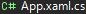  W   
　　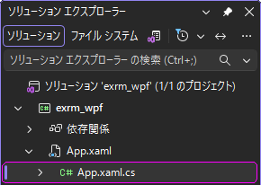  
　　　　　　　  
　　[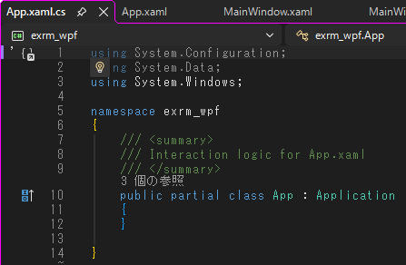](./assets/prtsc/M_VS_PANE_app-xaml-cs.png)　
　
[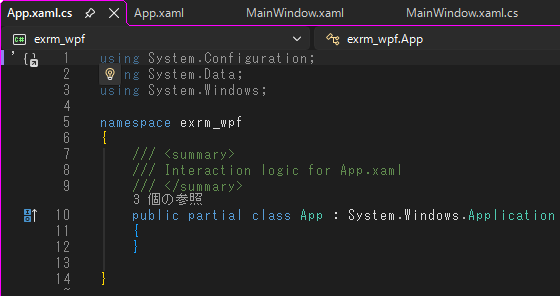](./assets/prtsc/M_VS_PANE_app-xaml-cs-after.png)  

<details>  
<summary>  
  
  : クラス名追記  

　　　旧：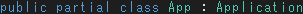  
　　　新：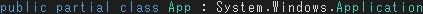  
</summary>  
  
```  
public partial class App : System.Windows.Application
```  
</details>  

## プロジェクトファイル変更 (WinForms有効化 & 単一EXE配布設定)  
　  ソリューションエクスプローラー   
　　   右        
　　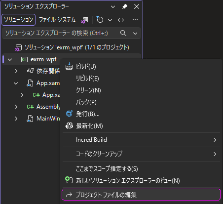   
　　　　　　　　  
　　[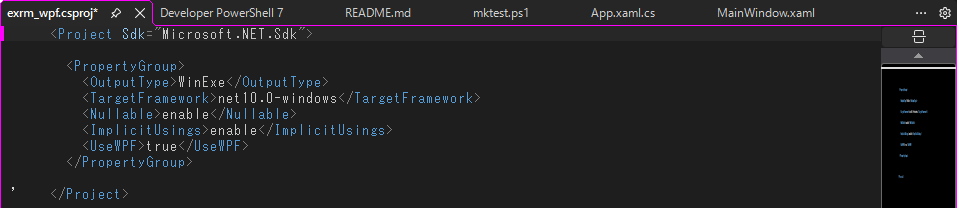](./assets/prtsc/M_VS_PANE_exrm-wpf-csproj.png)  
　　　　　　　　  
　　[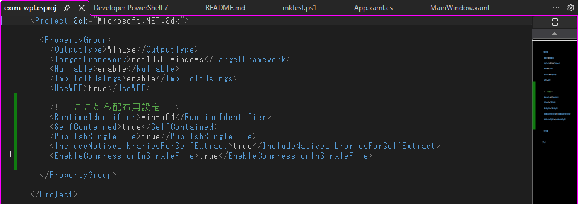](./assets/prtsc/M_VS_PANE_exrm-wpf-csproj-1st.png)  

<details>  
<summary>
  
  : WinForms有効化、単体起動(.exe)作成コマンド追加  
</summary>  
  
```  
    <!-- ここから配布用設定 -->
    <RuntimeIdentifier>win-x64</RuntimeIdentifier>  
    <SelfContained>true</SelfContained>  
    <PublishSingleFile>true</PublishSingleFile>  
    <IncludeNativeLibrariesForSelfExtract>true<IncludeNativeLibrariesForSelfExtract>  
    <EnableCompressionInSingleFile>true</EnableCompressionInSingleFile>  
```  
</details>  

## テスト環境構築  
　  ソリューションエクスプローラー    
　　   右  
　   
　     
　　[](./assets/prtsc/M_VS_PANE_solution-explorer03%20.png)  
　　　　　　　  
　　   mktest.ps1  指定 
   
　　　　　　　  
　　[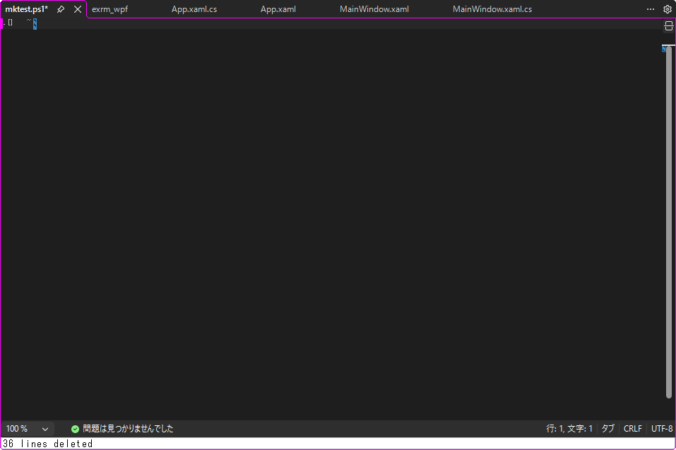](./assets/prtsc/M_VS_PANE_exrm-wpf-after.png)
<details>  
<summary>
  
  Source code　　　   
</summary>  
  
```  
#!/usr/bin/pwsh
#Requires -Version 7.0
mkdir test1st
cd test1st
New-Item test_11.txt
New-Item test_12.txt
New-Item work_11.txt
New-Item work_12.txt
New-Item dummy_11.txt
New-Item dummy_12.txt
mkdir test2nd
cd test2nd
New-Item test_21.txt
New-Item test_22.csv
New-Item work_21.txt
New-Item work_22.csv
New-Item dummy_11.txt
New-Item dummy_12.txt
cd ..
mkdir test3rd
cd test3rd
New-Item test_31.txt
New-Item test_32.csv
New-Item work_31.txt
New-Item work_32.csv
New-Item dummy_11.txt
New-Item dummy_12.txt
cd ..
mkdir work4th
cd work4th
New-Item work_41.txt
New-Item work_42.txt
cd ../..
# & c_write "Cyan" "`r`n --- Test Environment ----"
Write-Host "`r`n --- Test Environment ---" -Foreground Cyan
tree /f test1st
```  
</details>  

## バージョン管理登録(Git)  
### Gitリポジトリの作成  
　
 右下の 
 
 
 
　
 　
 
 
 
  
　　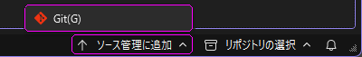  
　　　　　　　　  
　　    　
 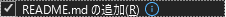  　
 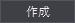    
　　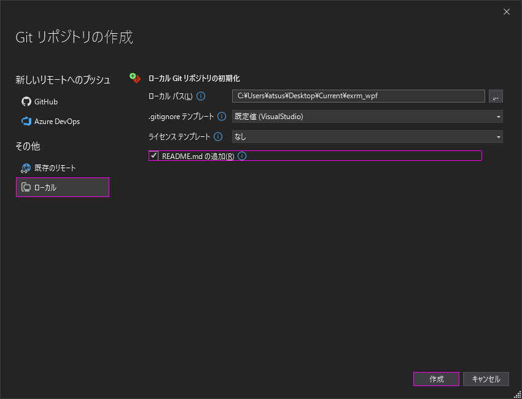  

> [!NOTE]
> Gitをローカルに作成します (GitHubへの登録は別途)  

　　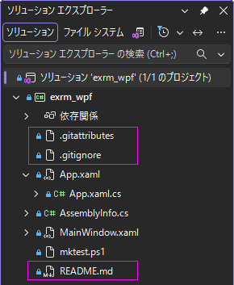  
　　Gitリポジトリ作成で付加されるファイル  
　　　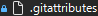 : Gitでのファイル/フォルダの属性(改行コード、差分表示等の設定)  
　　　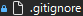 　: GitHubへのPushルール  
　　　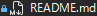 : GitHubで表示されるREADME   

### Git README.md 編集  
　　 　:　 [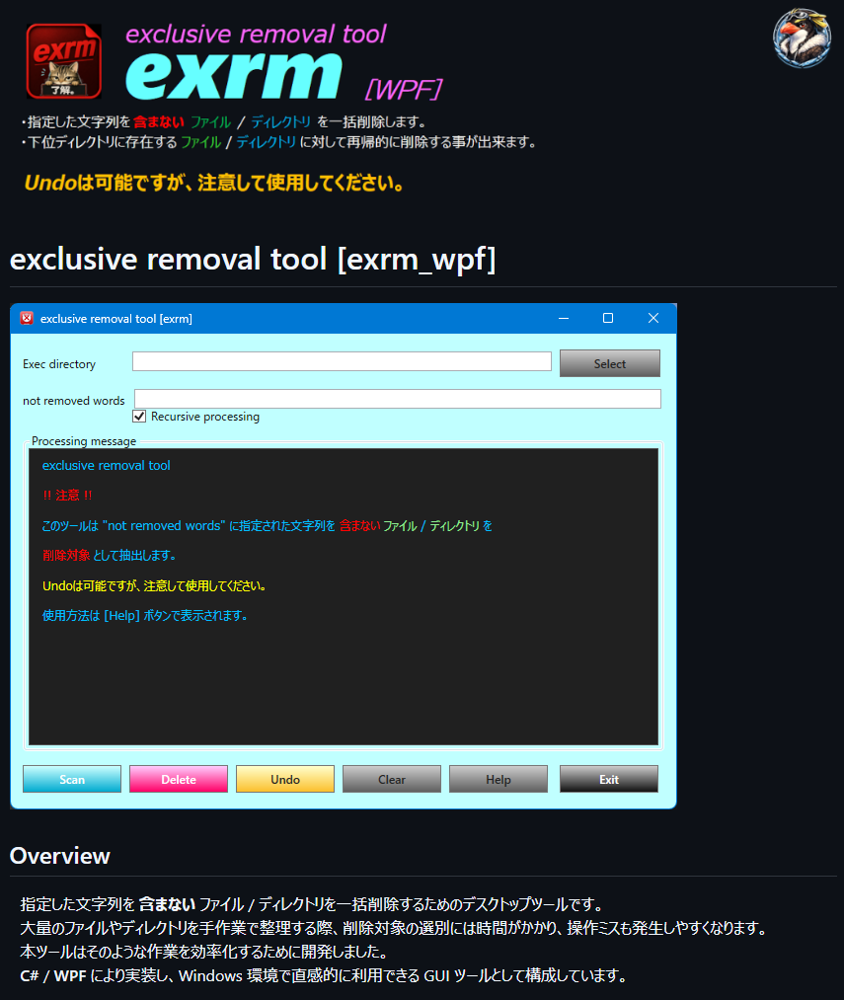](https://github.com/AHazeyama/exrm_wpf)  
　　　Source code [ README.md](https://github.com/AHazeyama/exrm_wpf/edit/main/README.md)  
 
## Debug用DIR作成
　  ソリューションエクスプローラー    
　　 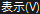  右  　
 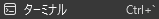    
　　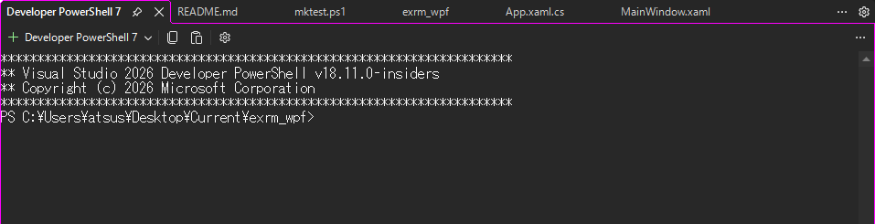  
<details>  
<summary>
  
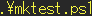
&nbsp;  
</summary>  
  
```  
.\mktest.ps1  
```  
</details>  

　　[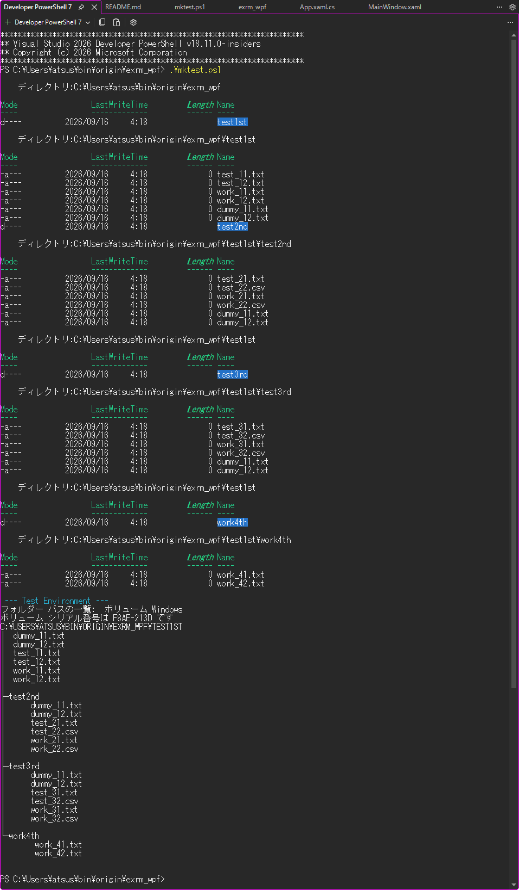](./assets/prtsc/M_VS_PANE_power-shell-mktest.png)  

## 動作確認  
### 　アプリ起動  
　
 
 メニューバー 
 の
     

　　[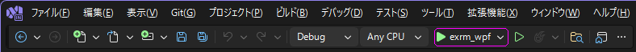](./assets/prtsc/M_VS_PANE_menu-exrmwpf.png)

　　　　　　　  
　　[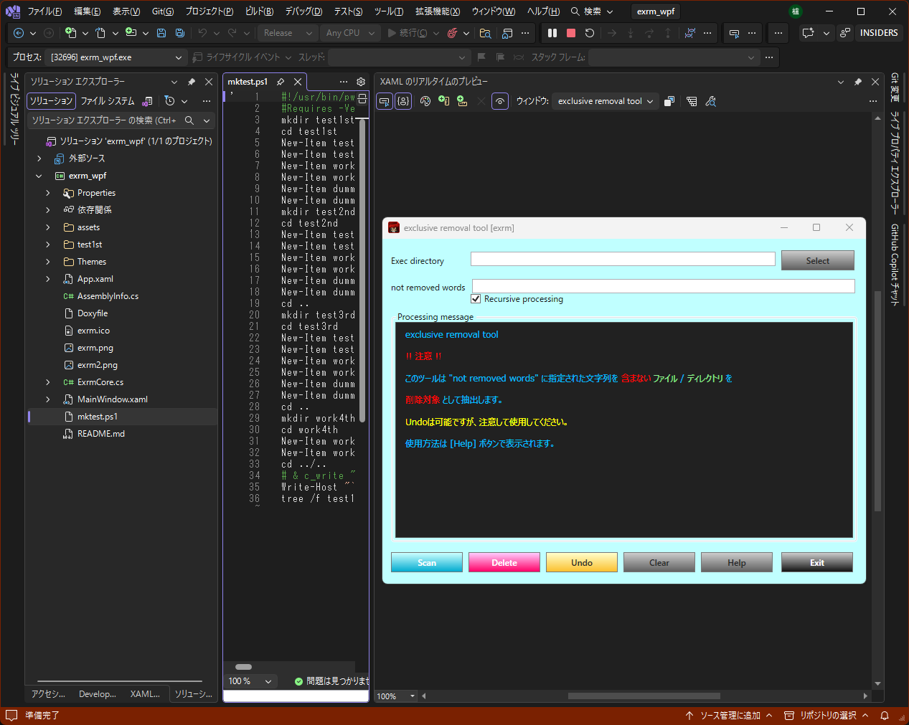](./assets/prtsc/M_VS_WIN_exrm-run.png")
　　[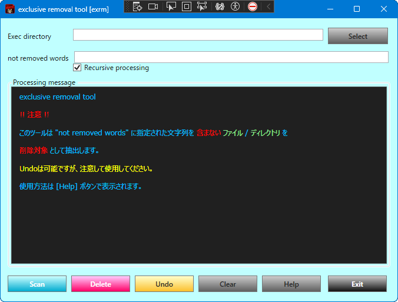](./assets/prtsc/M_VS_WIN_exrm-exe.png)  

### 　試行 (  test1st で実施 )
1.  、処理対象DIRを選択  
2. 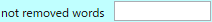 に**削除除外対象**に含まれる文字列を指定  
複数指定する場合は "**,**" で区切って下さい
3.  を  、 **Prossesing nessage** に表示される削除対象を確認  
4. 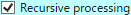  で、下位階層に対する処理の可否を選択 
5.   で実行
6. 必要に応じて   で元に戻せます。
<br>

## 単体アプリ作成  
###  バージョン指定
　
 ソリューションエクスプローラー   
　　　    
　     
　　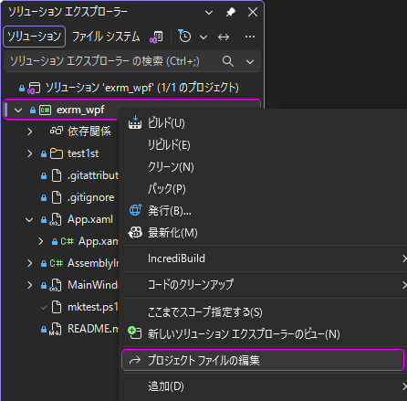  
　　　　　　　  
　　[](./assets/prtsc//M_VS_PANE_exrm-wpf-csproj-1st.png)  
　　　　　　　  
　　[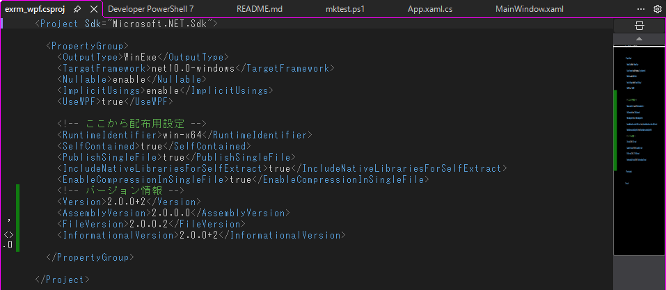](./assets/prtsc/M_VS_PANE_exrm-wpf-csproj-2nd.png)  
<details>  
<summary>
　  
  : Version情報追記  
</summary>  
  
```  
    <!-- バージョン情報 -->
    <Version>2.0.0+2</Version>
    <AssemblyVersion>2.0.0.0</AssemblyVersion>
    <FileVersion>2.0.0.2</FileVersion>
    <InformationalVersion>2.0.0+2</InformationalVersion> 
```  
</details>  

### 　 icon 作成
　　 **exrm.ico** を作成  
　　解像度：256, 128, 96, 64, 48, 32, 16 [Pixel]の画像をを内包する".ico"ファイルを作成します。  
　　方法はお任せ。VisualStudioでも作成出来ます(方法は省略)。  
　　　GitHub [ exrm_wpf.ico](https://github.com/AHazeyama/public/blob/main/exrm_wpf/exrm_wpf.ico)  
　　　.ico作成ツール [ GreenFish Icon Editor Pro ](https://greenfishsoftware.org/)　　　  

###  iconをプロジェクトへ追加
#### 　　 .icon追加
　  ソリューションエクスプローラー    
　　　 ペイン内の空白部分  右  　
    　
     
　　　[](./assets/prtsc/M_VS_PANE_solution-explorer09.png)  
　　　　　  
　　　 :  **.ico**  選択  
　　　　　  
　　　[](./assets/prtsc/M_VS_WIN_icon-editor.png)  

> [!NOTE]
> &emsp;必要なら   


#### 　 アプリにアイコンを設定
　　  ソリューションエクスプローラー    
　　　   右  　
    　 **.ico** 選択  
　　　[](./assets/prtsc/M_VS_PANE_solution-explorer10.png)
　　
[](./assets/prtsc/M_VS_PANE_exrm-wpf-property.png)　
　
  
　　　  
  

#### 　 アイコン設定  
　　
 ソリューションエクスプローラー   
　　　   右 
　     
　　　  
　　　　　　　  
　　　[](./assets/prtsc/M_VS_PANE_exrm-wpf-csproj-2nd.png)  
　　　　　　　  
　　　[](./assets/prtsc/M_VS_PANE_exrm-wpf-csproj-3rd.png)  
<details>  
<summary>
　　  
  : Version情報追記  
</summary>  
  
```  
    <!-- icon setting -->
    <ApplicationIcon>exrm.ico</ApplicationIcon>

  </PropertyGroup>      # このTAGは既存、これ以上とこれ以下のコマンドを追記

  <!-- icon setteing -->
  <ItemGroup>
    <None Remove="exrm.ico" />
  </ItemGroup>
```  
</details>  
<br>

### 　 単一exe化（Single File Publish）  
　　
 ソリューションエクスプローラー   
　　　   右  　
     
　　 　[](./assets/prtsc/M_VS_PANE_exrm-wpf-csproj-2nd.png)  
　　　　　　　  
　　　    　
   　
     
　　　[](./assets/prtsc/M_VS_DLG_public01.png)  
　　　　　　　  
　　　    　
   　
     
　　　[](./assets/prtsc/M_VS_DLG_public02.png)  
　　　　　　　  
　　　    　
    　
**出力**  **選択** 　
     
　　　[](./assets/prtsc/M_VS_DLG_public03.png)　
　
  
　　　　　　　  
　　　     
　　　[](./assets/prtsc/M_VS_PANE_exrm-wpf-issue1.png)  
　　　　　　　  
　　　[](./assets/prtsc/M_VS_PANE_exrm-wpf-issue2.png)  
　　　　　　　  
　　　[](./assets/prtsc/M_VS_PANE_exrm-wpf-issue3.png)  

　　出力先   
　　　**exrm_wpf\bin\Release\net10.0-windows\win-x64\publish**  
　　　
> [!CAUTION]
> ⚠️ 🗁 win-x64 以下のexeは **.dll** が必要( **️単体ではない** )。  

### 　Visual Studio使わない方法  
　　プロジェクトフォルダ（.csproj がある場所）で  

　　 
<details>  
<summary>
  COMMAND  
</summary>  

```  
dotnet publish -c Release -r win-x64 --self-contained true ` 
-p:PublishSingleFile=true -p:IncludeNativeLibrariesForSelfExtract=true
```  
</details>  

　[](./assets/prtsc/M_VS_PANE_pwsh-exe-issue.png)  

## Git 更新 (README.md、exrm.exe)  
　
 右下の 
 
 
 
  
　　  
　　　　　　　　  
　      
> [!TIP]
>  個別にaddする場合は各 右側の      

　　  
　　　　　　　　  
　　   へコミットメッセージを入力       

> [!TIP]
>   : CopilotによるCommitメッセージ自動生成可能

　　  

### 以上で開発は終了です。
### 　検証項目 (Example: normal system 、  test1st で実施 )
1.  、処理対象DIRを選択  
2.  に**削除除外対象**に含まれる文字列を指定  
複数指定する場合は "**,**" で区切って下さい
3.  を  、 **Prossesing nessage** に表示される削除対象を確認  
4.   で、下位階層に対する処理の可否を選択 
5.   で実行
6. 必要に応じて   で元に戻せます。

　　 検証のバリエーションに関しては別途記載予定
<!-- 後日、SoftwareDevelopmentGuide整備後に記載  
#### 項目設定方法  
　[🔗SoftwareDevelopmentGuideへのリンク]  
-->  
